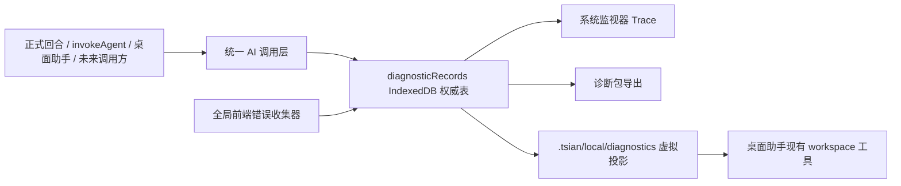

# 统一 AI Trace 与开发者诊断包：总体设计

## 1. 架构边界

统一 Trace 由四层组成：

1. AI 调用层负责在真实 provider 请求边界创建和完成 Trace，不由正式回合、`invokeAgent` 或桌面助手分别记录。
2. 诊断存储层以一张全局 IndexedDB `diagnosticRecords` 联合表作为唯一权威数据源。
3. 系统监视器和诊断包通过查询服务读取权威记录，不再解析 workspace JSONL。
4. 桌面助手通过 `.tsian/local/diagnostics/` 虚拟只读投影按需读取同一数据，不产生第二份持久化副本。



## 2. 统一记录契约

联合表记录拥有公共字段：

- `id`：表主键；AI 记录等于 `requestId`，前端错误等于 `errorId`。
- `recordType`：仅为 `ai-request` 或 `frontend-error`。
- `timestamp`、`updatedAt`：统一排序和清理依据。
- `schemaVersion`、`sizeBytes`：结构版本与基于 UTF-8 JSON 序列化长度的保留计量。

AI 请求记录包含：

- `requestId`、`operationId`、可选 `parentRequestId` / `previousRequestId` 与 `sequence`。
- `status`：`running`、`succeeded`、`failed`、`aborted`、`interrupted`。
- provider、model、经脱敏的 endpoint、参数、streaming 标记。
- 完整消息、工具声明以及可识别但不内联二进制的附件元数据。
- 最终组装后的完整响应正文、工具调用、finish reason、usage/cache、耗时。
- `attempts[]`：每次网络尝试的开始/结束、结果、重试等待和结构化错误。
- 非流式响应可保存脱敏后的 provider payload；流式响应保存最终组装语义，不保存逐 token SSE 帧。

不进入 schema 的字段包括 turn、saveId、sessionId、agentId、debugLabel、入口/渠道名称、Skill 或 workspace runtime 事件。高层调用只创建通用 `operationId`；多轮工具循环沿 `previousRequestId` 串联，委派调用使用 `parentRequestId`，网络重试留在同一请求的 `attempts[]` 内。

前端错误记录使用固定结构：`errorId`、`kind`、时间、message/name/stack、source URL/line/column 或 resource URL，以及可用的 Vue 组件名称。`kind` 仅覆盖未捕获运行时异常、未处理 Promise rejection、Vue 全局错误和资源加载失败。

## 3. 写入、脱敏与存储健康

- AI 调用入口在发出请求前同步生成 UUID 并写入 `running` 记录；成功、失败、取消都在 finally 路径完成记录。
- `withAiRequestRetry` 提供 attempt observer，把重试事实写回当前记录，不再依赖 console 作为诊断来源。
- Agent Runtime 传递一个不持久化的通用关联上下文。每个高层调用创建 operation，工具轮次更新 previous request，委派分支从当前 request fork。
- 脱敏器在持久化前递归移除 API Key、Authorization、Cookie、Set-Cookie、常见 token/header 键，并清除 URL 查询凭据；导出时再次处理。
- IndexedDB 写操作通过单一队列或事务串行化，避免当前 AI Debug “读取整个数组再覆盖”的并发丢失。
- Trace 写入失败不抛回 AI 主流程。内存级 `diagnosticStoreHealth` 累计当前会话的丢失数、最近失败时间和错误摘要，监视器显示“记录可能不完整”。
- 启动时把上次页面遗留的 `running` 记录标记为 `interrupted`，并执行保留清理。

## 4. IndexedDB 与保留策略

在当前数据库名内增加 Dexie schema 版本和 `diagnosticRecords` 表，避免仅为新表重命名数据库而清空卡片、存档等既有本地数据。索引至少覆盖主键、recordType、timestamp、status、provider、model、operationId、parentRequestId。

清理规则：

- 固定保留 7 天且总 `sizeBytes` 不超过 100 MiB。
- 启动、完成记录和新增前端错误后触发清理；任一上限命中即按 timestamp 最旧优先删除。
- 正在写入的 `running` 记录暂不清理；完成后立即重新计量。附件 Blob 不内联，因此单条记录超过总上限不是正常路径。
- 查询必须分页，系统监视器不一次加载完整正文集合。

## 5. 系统监视器

移除当前彼此割裂的 AI Debug 与按 Turn Runtime Trace 展示，改为一个两栏 Trace 面板：

- 左侧按时间倒序分页显示 AI 请求和前端错误摘要，清楚标注状态、provider/model、耗时、重试次数。
- 顶部支持时间、状态、provider/model 与文本过滤，不提供渠道过滤。
- 右侧按请求、响应、工具、usage、尝试/错误、原始 JSON 分区，正文使用可滚动/折叠区域而非一段 JSONL 文本。
- Overview 的 token/cache/provider 统计改读统一 Trace 摘要。
- 记录更新事件触发增量刷新；诊断存储健康异常显示独立警告。

旧 `.tsian/save/traces/**`、`.tsian/local/assistant/traces/**` 与 `AiDebugRecord` 不迁移到新表。升级后停止新增旧记录，并移除旧 parser、resource query 与 DebugBridge 读取入口；监视器、诊断包和 workspace 投影完全看不到旧数据。旧存储内容保持原样，不主动删除。

## 6. 诊断包

导出算法：

1. 以用户选中的失败记录为锚点；未选择时取最新失败记录。
2. 从锚点开始按倒序时间线向更早记录取 50 条联合记录，不加入无关的更新记录。
3. 对锚点 AI 记录求 operation、parent、previous 关系闭包，并补齐缺失关联记录；关联链可以使总数超过 50，也可以包含为保持链完整所必需的较新记录。
4. 对最终集合再次执行凭据脱敏，再生成 zip。

Zip 结构：

```text
manifest.json
summary.md
reproduction.md
platform.json
configuration.json
records/index.jsonl
records/requests/<requestId>.json
records/frontend-errors/<errorId>.json
```

`platform.json` 包含应用/构建版本、schema、浏览器与系统环境、locale/timezone；`configuration.json` 只包含脱敏后的 provider/model/参数摘要。`reproduction.md` 来自用户导出时填写的复现步骤。导出界面不提供“是否包含对话”或时间范围选项。

## 7. 虚拟 workspace 投影

投影路径固定为：

- `.tsian/local/diagnostics/index.jsonl`
- `.tsian/local/diagnostics/requests/<requestId>.json`
- `.tsian/local/diagnostics/frontend-errors/<errorId>.json`

在 workspace operation 内部增加可选虚拟读取适配器，支持 list/read/search；Agent 看到的工具名称和参数保持不变。桌面助手 host 注入 diagnostics adapter，普通运行时 Agent 不注入。

- `index.jsonl` 由记录摘要按时间倒序动态生成，支持 offset/limit。
- request/error 文件按主键从 IndexedDB 单条读取。
- search 使用 IndexedDB cursor 按记录逐条匹配并在达到 limit 时停止，不构建 100 MiB 内存快照。
- diagnostics 前缀在写、删、移动、复制时统一返回只读错误；level 4 不绕过该规则。

## 8. 旧数据、回滚与风险

- 既有应用数据：新表采用同名数据库的新增 Dexie schema 版本，保留卡片、存档等非诊断数据。
- 旧诊断数据：不迁移、不读取、不展示、不导出；只允许原 save 删除/生命周期清理代码把旧文件当普通遗留数据删除，不保留诊断兼容 reader。
- 回滚：新存储与旧 save/workspace 文件解耦；代码回滚不会修改用户卡片或存档。新增表可以保留等待后续版本重新读取。
- 风险：完整正文可能加快 100 MiB 清理，符合用户选择；UI 和 workspace 必须始终分页/按需读取。
- 风险：异步 Trace 更新可能乱序，使用 UUID 主键、写队列和 per-record update 避免覆盖。
- 风险：错误收集器自身失败可能递归，收集器必须吞掉持久化异常并通过非持久化健康状态报告。

## 9. 子任务依赖

1. `07-30-unified-ai-trace-core` 先完成并稳定 schema、存储和查询服务。
2. `07-30-ai-trace-monitor-diagnostic-export` 与 `07-30-diagnostics-workspace-projection` 明确依赖核心，可在核心完成后并行。
3. 父任务最后执行正式回合、`invokeAgent`、桌面助手、前端错误、导出和 workspace 读取的跨层集成验收。
