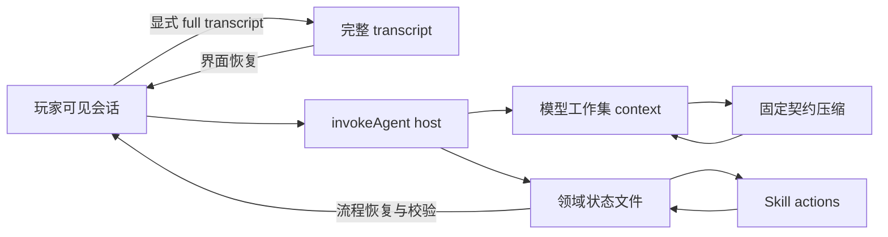

# 重构 Agent 上下文状态与压缩 — Technical Design

## 1. 设计目标与边界

本任务把当前混在 `AgentContextSnapshot` 和自然语言回复中的三类信息拆开：

- **会话档案**：完整、可恢复、不可因模型压缩而丢失；只为已有正式 turn、桌面助手和明确声明为玩家可见的持久 `invokeAgent` 会话保存。
- **模型工作集**：`summary + recent entries + semantic tool memories`，允许有损压缩，但必须能继续当前工作。
- **领域状态**：开局进度等不可丢失的流程事实，由 workspace 文件和确定性 action 维护。

平台负责通用上下文生命周期、Tool Memory 和 transcript；卡片负责开局进度语义、提交规则和 world-architect 的 AI-facing 内容。压缩不能成为领域数据库，transcript 也不进入每次模型请求。



不在本任务中改变压缩触发比例、模型 context window、storyteller 文风机制或未证实有问题的 frontier 窗口语义。

## 2. Agent context sequence

### 2.1 新语义

游戏 `turn` 只表示正式剧情进度；Agent context 使用独立单调递增的 `sequence`。每次成功持久化的 Agent 交互占用一个 sequence，失败或回滚不推进。

`AgentContextSnapshot` 演进为 v2 语义：

```ts
interface AgentContextSnapshot {
  schema: "tsian.agent.context.v2" | "tsian.assistant.context.v2"
  saveId: string
  agentId: string
  sequence: number
  summary: string | null
  recentTurns: AgentContextTurnEntry[]
  toolMemories?: AgentContextToolMemory[]
  lastCompressedSequence: number | null
  updatedAt: string
}

interface AgentContextTurnEntry {
  sequence: number
  gameTurn?: number
  role: "user" | "assistant"
  content: string
}
```

Tool Memory 同样使用 `sequence` 老化；需要诊断关联时可保存 `gameTurn`，但任何 recent/retention/compression 判断不得再使用游戏 turn。

### 2.2 分配与落盘

- 正式 narrative turn：从该 Agent 快照的 `sequence + 1` 分配，另存本次正式 `gameTurn`。
- 桌面助手：沿现有会话序列推进；不依赖游戏 turn。
- `invokeAgent(persist:true)`：在同一 `agentId + contextSlot` 队列内读取快照，使用 `sequence + 1`；context、可选 transcript 和 action 的 workspace 变更在同一事务成功后一起可见。
- `persist:false`：只在当前调用内使用临时 sequence，不创建跨轮状态。

旧 v1 快照由 parser 兼容读取：旧 entry/memory 的 `turn` 映射为 `sequence`，同时作为 `gameTurn` 关联；`lastCompressedTurn` 映射为 `lastCompressedSequence`。下一次成功写入 v2。测试期旧开局会话不提供业务迁移，仍按 PRD 要求由新存档测试。

## 3. 三类压缩契约

### 3.1 统一机制

新增显式 `CompressionKind`，由调用链选择：

- `task-continuation`：跨用户轮的任务继续快照。
- `task-checkpoint`：同一次调用中工具循环的恢复 checkpoint。
- `narrative-continuity`：正式剧情连续性摘要。

每种 kind 有独立 system prompt、固定 Markdown section 列表、结构校验器和一次 repair 机会。第一次输出缺 section、重复 section、超限或为空时，向压缩模型发送原输出和校验问题进行一次修复；再次失败抛现有温和压缩错误，不保存自由格式摘要。

### 3.2 固定输出结构

`task-continuation`：

```md
## 当前目标
## 有效约束
## 已确认决策
## 权威状态与产物
## 已完成结果
## 当前工作点
## 未解决问题
## 下一步
```

`task-checkpoint`：

```md
## 本轮目标
## 已验证事实
## 持久化效果
## 当前未完成操作
## 最新有效错误
## 恢复动作
```

`narrative-continuity`：

```md
## 当前场景
## 关键因果经过
## 玩家选择
## 角色与关系变化
## 线索与未决事项
## 紧接续点
```

prompt 共同声明：输入消息 role 不是权威等级；按明确来源、验证结果、持久化结果和后续 supersession 判断；输出当前快照而非时间线；不得从当前切片缺失推断全局不存在；ID、路径、ref、hash、revision、receipt 和错误码逐字保留。

### 3.3 精确未完成操作

同轮 task 压缩先按工具调用与 observation 组成原子交互。最近尚未解决的写入、提交、外部草稿/句柄或失败恢复操作作为 pinned interaction 保留原始调用和结果，不进入有损摘要；同一 supersession key 的后续成功会解除旧失败。普通读取、搜索和已解决尝试可以摘要或丢弃。

如果 pinned payload 本身已大到无法组成合法请求，运行时必须要求该操作改用 workspace 文件、receipt 或其他外部权威引用；不得用近似 JSON 代替精确 payload。

### 3.4 快照替换语义

再次压缩把旧 summary 当作一个有标注的候选快照，与新事实一起重写完整 summary。新摘要必须删除已被 supersede 的失败、决定和下一步，而不是不断追加历史日志。

## 4. Tool Memory 语义投影

### 4.1 两个通道

- 当前工具循环继续保留 provider 协议所需的精确 tool call/result。
- 跨 sequence 只保存 `ToolMemoryProjection`，UI timeline 和 diagnostics 继续保存各自的展示/审计投影，三者不得互相冒充。

规范化投影包含：

```ts
interface ToolMemoryProjection {
  key: string
  status: "success" | "failed"
  title: string
  summary: string
  anchors?: string[]
  exact?: Record<string, JsonValue>
  resolves?: string[]
}
```

宿主补充 `sequence/gameTurn/toolName/sourceToolCallId` 后写入 `AgentContextToolMemory`。`key` 是 supersession key；同 key 的新结果替换旧结果，成功清除其解决的失败。总量限制仍作为最终保险，但长期记忆不再以“截取 observation 前 N 字符”为主要策略，也不再用 placeholder 保存无意义过程。

### 4.2 内置 projector

- `use_skill`：永不持久化。
- 普通 list/search/glob/diff、参数错误、重复读取：默认不持久化。
- workspace 写入/编辑/移动/删除：保存路径、结果、可用 hash/revision/receipt。
- source/read：通用读取不保存正文；只有能提供 ref、范围、用途和确认结论的专用 projector 才保存语义记录。
- diagnostics/外部调用：只保留最新未解决错误、诊断 id、外部 draft/operation handle 和恢复方式。
- `run_script` 与用户 Tool：优先采用 action 显式投影；没有显式投影时使用保守内置 projector，不能回退为大段脚本输出。

### 4.3 Browser script 显式投影

在 browser-script Worker SDK 增加独立 side channel `tsian.memory.set(projection)`。它最多接受一份有界投影，宿主校验 key/title/summary/anchors/exact 的 JSON 形状和大小。脚本最终 `return` 值仍是本轮模型 observation；memory side channel 不混入 action output，因此不破坏既有 output schema。

Skill action 与 Agent Tool 共用 browser-script executor，所以两者自动获得同一机制。未调用该 API 等于明确不提供持久语义投影。

### 4.4 链路策略

- persistent task `invokeAgent`、桌面助手：注入保留后的语义 Tool Memory。
- narrative 正式回合：Tool Memory 可用于压缩输入和必要恢复，但不把任务日志直接作为剧情 prompt 段；无语义投影时不保存。
- one-shot/delegated：本次 loop 内保留精确结果，默认不落跨调用 Tool Memory；父 Agent 只接收委派结果投影。

## 5. Skill 加载与 action 解析

`use_skill` 的返回字段改为 `loaded: true`，语义仅为向模型展示完整 `SKILL.md` 和 action 索引。session state 可以缓存已解析声明以节省同轮解析，但不是授权状态。

`run_script` 每次执行时：

1. 从当前 `agentContext.skillIndex` 解析可见且启用的 Skill。
2. 从当前 workspace 读取该 `SKILL.md` 并解析 action，或命中同内容版本的同轮缓存。
3. 校验 action 声明、browser-script executor、workspace visibility、executor policy 和 mutation scope。
4. 执行并校验 output。

不可见、禁用、未声明 action 仍失败。旧 `SKILL_NOT_ACTIVATED` 路径删除；旧持久 Tool Memory 中的 `use_skill` 记录在新 retention 中直接淘汰，不恢复任何状态。

## 6. 玩家可见 persistent invokeAgent transcript

### 6.1 opt-in 合约

`InvokeAgentRequest` 新增：

```ts
transcript?: { mode: "full"; audience: "player" }
```

该选项只允许与 `persist:true` 和非空 `contextSlot` 一起使用。调用方不能传任意存储路径；宿主从 `agentId + safeSlot` 派生：

```text
save/agents/<agentId>/transcripts/<safeSlot>.json
```

后台 persistent 调用不传该选项，因此不会产生无消费者 transcript。

### 6.2 文件结构与原子性

`tsian.agent.invocation-transcript.v1` 保存 `agentId/slot/lastSequence/entries[]`。每个 entry 含 `sequence/invocationId/purpose/createdAt`、精确 request content、投影后的 assistant `content/displayContent/projections` 和有界 UI timeline。entries 只追加、不压缩、不计入模型 token 预算。

宿主在模型成功、reply projection 完成后，将 context 和 transcript 都 stage 到当前 workspace transaction；任一写入或最终 commit 失败则两者均不可见。opening frontend 用 transcript 恢复消息和 `openingChoices`，用 progress/control 恢复流程状态。

## 7. 开局进度权威

### 7.1 文件和职责

新增 `save/playthrough/opening-progress.json`：

```ts
interface OpeningProgress {
  schema: "novel-airp.opening-progress.v1"
  sessionId: string
  sourceHash: string
  branch: "canon" | "original"
  revision: number
  processedAttemptId: string
  protagonist?: OpeningProtagonist
  decisions: Record<string, OpeningDecision>
  unresolved: Record<string, OpeningUnresolved>
  readSlices: OpeningReadSlice[]
  phase: "interviewing" | "ready-to-commit" | "complete"
  updatedAt: string
}
```

现有 `opening-interview.json` 继续只拥有 source/session/branch、当前 attempt、revision 和 final receipt。两者通过 revision/attempt/session/source/branch 一致性连接；assistant 消息不再拥有状态权威。

### 7.2 actions

《开局建模》新增或改造两个 action：

- `read_opening_progress`：读取 control + progress，验证会话不变量并返回当前快照；revision 0 且文件不存在时返回合法初始状态。
- `advance_opening_progress`：接收 session CAS（session/source/branch/basedOnRevision/attemptId）和下一份完整语义快照。脚本验证结构、旧决策继承、readSlices 去重/范围、phase 转移和当前 submitted attempt；在同一 workspace transaction 中写 progress、推进 control revision 并清除已处理 attempt。

同一 attempt + 相同 payload 重试返回原结果；同一 attempt 不同 payload、旧 revision 或 branch/source 冲突失败。`commit_opening` 成功时同步把 progress 置为 `complete`，并继续写原有 receipt/control/setup-summary。

### 7.3 前端流程

- 启动前写 control；第一次调用的 progress CAS 为 `0 -> 1`。
- 玩家回答先写 submitted attempt，再调用带 full transcript 的 persistent `invokeAgent`。
- 成功返回后，前端读取 control/progress 验证 expected attempt/revision；消息展示来自本次 response 的投影。
- 页面恢复时，transcript 重建完整对话，progress/control 决定可继续、待重试、完成或冲突状态。
- 删除 `[[开局会话]]` 的生成、扫描、语义继承和恢复依赖；保留 `[[开局选项]]` reply projection 作为玩家选项通道。

卡片 README、Skill 和 reply projection 删除 opening-state 规则及过期说明。现有测试存档不迁移。

## 8. `commit_opening` 批量校验

批量校验限定在 `commit-opening.js` 的领域层，不把通用 `validateActionInputSchema()` 扩展成递归 all-errors 校验，避免改变全部 Skill/Tool 的既有错误契约。

action 顶层 required/type 通过通用浅层门禁后，脚本按 section 运行有界 collector：

- 最多 32 个 `{ code, path, message, details? }` issue，并返回 `truncated`。
- entities、scenes、relationships、runtime、frontier、summary、openingReply 各自先做局部结构归一化。
- 只有依赖前提有效时才运行跨引用/闭包校验，避免同一根因产生级联错误。
- `tsian.reply.project` 的 openingReply 投影问题进入同一 issue 列表。
- 任一 issue 存在时抛 `OPENING_COMMIT_INVALID`，`details.issues` 携带列表，且在第一次 `workspace.write` 前结束。
- source/control/save-cleanliness 等外部前置条件仍可作为单一 fatal error；它们不是 payload 批改列表。

脚本继续依赖宿主 workspace transaction 提供最终原子性，批量校验本身保证 validation 阶段零写入。

## 9. world-architect 常驻上下文治理

按内容权威重新分工，并同步实际卡 workspace 与平台生成模板：

- `docs/novel-airp-schema-guide.md`：完整通用 AIRP 参考，改为按需读取，不常驻。
- `save/schema/current.md`：只记录当前存档相对通用 schema 的实际 profile、扩展和变更状态；删除通用字段百科。
- `save/**/README.md`：只描述目录所有权、文件布局和读取入口，不重复 entity/runtime/schema 字段。
- `world-architect/AGENT.md`：只保留角色职责、不可违反的边界和何时加载 Skill。
- Skill：保留工作流判据、action contract 和当前操作所需字段，不解释其他文档已拥有的通用背景。
- `agent.json contextPaths`：移除完整 schema guide 等低频全文；保留经上述精简后每轮确实需要的最小动态状态。

实施前后记录注入文件字符数/估算 token 和来源清单，测试必要的 source identity、current schema profile 与 Agent 行为约束仍被装配。

## 10. 兼容性、回滚与风险控制

- v1 Agent context 只读兼容并在下次成功写入升级；完整正式 turn 和桌面助手消息存储不迁移。
- `InvokeAgentRequest.transcript` 是 opt-in；未传调用行为不变。
- Tool Memory 新 projector 若导致信息不足，可按工具恢复单个 projector；diagnostics/UI timeline 不受影响。
- opening progress、transcript 和 Skill 改造必须同批启用，避免 frontend 与 Agent 各读不同权威。该功能仍处测试期，不迁移旧开局会话。
- 卡片 workspace、`apps/platform-web/src/storage/workspace-templates/**` 和最终 `.tsian-card` 包必须由同一生成源同步；保留用户当前已修改的开局 Skill 内容并在其上演进。
- 浏览器真实开局集成由用户手动执行；自动化负责契约、事务、恢复和投影边界。

回滚按层进行：先关闭 opening transcript opt-in 并恢复旧 frontend/Skill 协议；平台通用 sequence、compression、Tool Memory 可按独立提交回退。不得只回退 progress action 而保留依赖它的 frontend。

