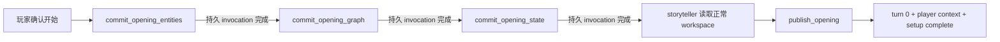

# 优化开局建模提交与实体落盘 — Technical Design

## 1. 设计原则

每个建模批次都是一个小型原子事务：先做足以防止明显坏数据的校验，全部通过后才写入正常 Runtime Workspace 路径。成功批次立即成为后续 Agent 可读的权威资料；失败批次零写入。

本任务不把开放的小说模型当成数据库 schema 做全量验证。校验只覆盖确定有消费者和高后果的边界：

- id/path 安全与核心必填字段；
- scene/relationship/runtime 的直接 ref 能找到前序文件；
- frontier 章节范围来自已导入 source；
- setup 尚未 complete、正式游玩未开始；
- turn 0 / player context 不覆盖既有正式进度。

不做 additionalProperties 全封闭、内容 hash、managed-path receipt、validation audit 或字段百科式递归校验。

## 2. 分阶段流程



每个 phase action 成功后，world-architect 更新工作笔记并结束当前 invocation。frontend 根据独立的 continuation 投影触发下一次 invocation。这样 workspace transaction 真正提交；如果把所有阶段和 storyteller 塞在一个 invocation，provider 最终失败仍会 discard 全部写入。

### 2.1 《开局建模》Skill 的新步骤

原 Skill 的访谈、定向读原著和玩家确认仍保留；“全量内存草案 → 完整 storyteller brief → 末尾原子提交”整体替换为：

1. **恢复与访谈**：处理 `start` / `answer`，读取 opening notes，按需取证并收敛玩家选择。
2. **实体阶段**：只组装本期开局实体，调用 `commit_opening_entities`；成功后更新 notes，输出 continuation 并结束 invocation。
3. **场景/关系阶段**：从正常 workspace 读取实体，只组装 scenes/relationships，调用 `commit_opening_graph`；成功后更新 notes，输出 continuation 并结束 invocation。
4. **状态阶段**：从正常 workspace 读取实体和 graph，组装 runtime/frontier/pending setup summary，调用 `commit_opening_state`；成功后更新 notes，输出 continuation 并结束 invocation。
5. **正文与发布阶段**：读取 notes 和已落盘模型，轻量委派 storyteller；核对正文终点后仅用 `responseRef` 调 `publish_opening`。publish 不再接收 entities/scenes/relationships/runtime/frontier。

Skill 不再规定“最后阶段成功前不得写正式 entity/scene/runtime”。阶段 action 成功、notes 更新并正常结束该次 invocation 后，该部分模型即完成正式持久化；最后仍需要 **publish**，但它只是把 storyteller 正文、turn 0、player context 与 `setup-summary.status=complete` 绑定为正式开局，不是再次提交世界模型。

## 3. Agent 可读进度笔记

复用当前已有：

```text
save/playthrough/opening-notes.md
```

建议内容：

```md
# 开局建模工作笔记

## 已确认
- 玩家角色：萧凌
- 切入点：第 1 章重生苏醒

## 已读原文
- 第 1～2 章：用于开局人物、地点和切入点

## 已完成
- 人物实体：萧凌、萧家外院小院

## 下一步
- 建立开局场景与必要人物关系

## 正文边界
- 停在萧凌确认重生、雪儿尚未进屋的时刻
```

该文件主要给 world-architect/storyteller 阅读。程序不解析 phase、路径或校验结果；它也不承担事务、幂等或数据权威。每个 action 成功后由 Agent 以自然语言更新，和本轮 workspace 变更一起随 outer transaction 提交。

## 4. Continuation 传输

Agent 在一个阶段成功、仍需继续后台建模时输出一个简短隐藏标记，例如：

```text
[[开局继续]]
```

reply projection 将其投影成 `openingContinue`，玩家界面只显示普通等待状态。frontend 不读取 `opening-notes.md`：

- 同页收到 `openingContinue` 时自动发 `opening-interview:continue:<sessionId>`；
- 同一次 continuation 没有推进或调用失败时停止自动递归，显示重试；
- 页面刷新后不自动调用模型，只根据 transcript 的最后投影显示“继续准备开局”；
- world-architect 收到 continue marker 后读取 opening notes 与正常 workspace，自行判断下一步。

《开局建模》Skill 的输入说明同步增加 `opening-interview:continue:<sessionId>`，并明确 continue 不是新的玩家回答，不得重新开始访谈或重复已落盘阶段。

## 5. Phase Actions

### 5.1 `commit_opening_entities`

输入是本期开局需要的完整 `entities[]`。

- 校验数组非空、id/path 安全、id 不重复、`name/brief` 非空；container/item 只做当前正式读写工具确实依赖的最小形状检查。
- 所有实体通过后才逐文件写入正常 `save/entities/...`。
- action 不校验任意 extensions、背景 prose、属性取值是否“语义正确”。
- 后续 graph 缺少 entity 时，graph action 零写入；world-architect 可补充 entity 后重试。

### 5.2 `commit_opening_graph`

输入是完整 `scenes[]` 与 `relationships[]`。

- 从正常 entity files 建已知 id 集合。
- 校验 scene id/name/location/present 与人物关系 subject/to 的直接引用。
- 全部通过后写 `save/scenes/...` 与 `save/relationships/...`。
- 不验证故事逻辑是否合理，不要求关系字段封闭为固定全集。

### 5.3 `commit_opening_state`

输入是 `runtime`、`frontier` 与玩家可读 `summary`。

- 校验 protagonist/location/active scenes 指向已存在文件。
- 校验 sourceWindow/timeline 的章节落在导入 source 中、至少有一个开局 source 节点。
- 写正常 runtime/frontier，并将 setup summary 保持 pending、但保存已生成的 summary，供最终 publish 使用。
- state 成功的 invocation 完成后才允许调用 storyteller。

## 6. Storyteller Handoff

storyteller 读取：

- `save/playthrough/opening-notes.md` 的正文边界；
- `save/playthrough/runtime.json`；
- active scene、present entities 与必要 relationships；
- frontier 中开局 source 节点及其剧情梗概。

`agent_call` 只传任务、authority 入口和输出格式，不复制 background/traits/status/地点/关系全文。

## 7. `publish_opening`

AI-facing input 只要求 `openingReply`，通过 `inputRefs.openingReply = storyteller.responseRef` 传入。

publish 做最低发布检查：

1. 当前 source/control 会话仍匹配；
2. setup 未 complete，runtime.turn=0，尚无后续 turn 或正式 player context；
3. runtime protagonist/location/active scene 的目标文件存在；
4. opening reply 可投影出非空正文和 1–12 个正式选项；
5. player-turn Agent 存在。

通过后原子写 turn 0、player context 与 `setup-summary.status="complete"`。它不重新接收或重写 entities/scenes/relationships/runtime/frontier。失败后正常模型与 opening notes 保留，重试范围只有 storyteller/publish。

## 8. Partial Model 与恢复

当前 frontend 的 `hasLegacyOpeningState` 需要放宽：在 source/control 合法、setup pending、opening notes 存在时，正常 entity/scene/relationship/runtime 文件视为可恢复的开局进度，而不是自动判定为旧脏存档。

这不是一般旧数据迁移规则。没有合法 source/control/notes 的未知正式文件仍按测试期 legacy state 处理。

阶段间默认保持已提交 id/path 稳定。该流程是一轮开局建模，不提供任意历史版本切换或通用级联迁移；若上游内容需要补充，优先在原 path 覆盖或添加缺失实体，不做复杂 generation ownership。

## 9. 原著剧情大纲与 Timeline 展示

现有 `frontier.timeline` 已是原著节点骨架，且正式回合会把当前 plotOrder 附近 source anchors 注入 storyteller。本任务给 source anchor 增加 optional `summary`：

```json
{
  "kind": "source",
  "order": 2,
  "chapter": 4,
  "time": "三日后",
  "label": "街头赌斗",
  "summary": "萧凌外出采购时遭白奎拦截，双方以狼牙匕为赌注约斗；冲突把萧家内部矛盾带到大吉镇街面。"
}
```

- summary 为 1–3 句已读内容客观梗概，不是创作指令。
- 开局建模产生首批；`frontier推进` 随后增量维护。
- context injection 给附近节点附带 summary；旧节点无 summary 时保持原行为。
- Timeline UI 在 anchor 有 summary 时展示：`order <= runtime.plotOrder` 的当前/过去节点直接显示，未来节点默认只显示“查看原著剧情（可能剧透）”入口，玩家点击后展开。
- 展开状态只保存在 Timeline 组件本地，不写 workspace、不改变 source anchor，也不限制 storyteller/stage-manager 读取完整 summary。刷新后重置为默认折叠即可。

不新增独立 Markdown 大纲。它虽然能写更长 prose，但会与 timeline 重复维护 order/chapter/label；当前 1–3 句节点梗概由 anchor 保持单一权威即可。

## 10. 代码边界与回滚

- 卡内 Skill/脚本权威：`cards/沉浸阅读器.tsian-card/workspace/**`。
- frontend continuation/context injection：`apps/play-frontend-dev/src/**`。
- platform 只注册 raw 卡文件并提供 action harness；不新增通用 provider 特判。
- 当前大 `commit-opening.js` 拆成共享轻量 helper + 四个 action，避免复制代码，也避免恢复旧宽松 split 死实现。
- 回滚必须同步恢复 Skill、scripts、reply projection、frontend continuation 与旧 atomic action。
