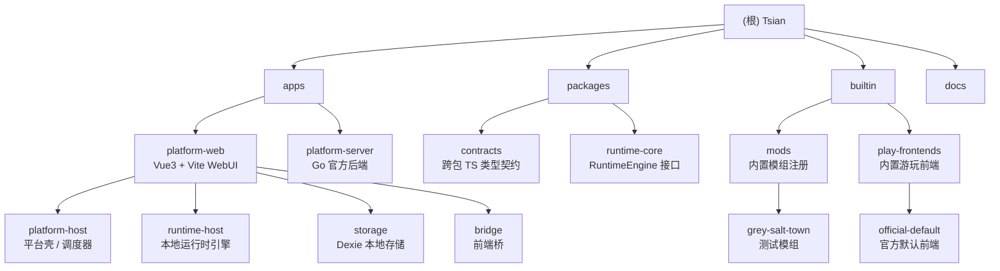

# Tsian (此间) — 项目级 CLAUDE.md

> AIRP（AI 驱动叙事/角色扮演）专精框架原型。本文件由初始化架构师生成，提供给 AI Agent 与新会话的项目快速接手手册。

---

## 1. 项目愿景

Tsian 是一个面向 AIRP 的最小可运行原型平台，目标是：

- 把"平台壳 / 运行时 / 游玩前端 / 模组"四件事拆成清晰契约
- 在浏览器内本地承载游玩运行时（IndexedDB / Dexie）
- 用三段 AI 主链（检索 AI → 正文 AI → 维护 AI）驱动剧情推进
- 把"实体档案 + 事件记忆 + globals + currentTime"作为运行时唯一真源

收敛后的项目方向：

- 平台与工坊由官方后端 (`apps/platform-server`) 与平台 WebUI (`apps/platform-web`) 提供
- 玩家游玩运行时默认在平台 WebUI 本地执行
- 官方平台负责模组与游玩前端包分发
- 玩家存档默认本地存储

---

## 2. 架构总览

主链（一轮交互）：

1. 玩家通过游玩前端发送输入
2. 平台 WebUI 调用检索 AI 生成实体查询组（可选语义增强）
3. 平台 WebUI 根据事件、档案与向量重排组装记忆补充
4. 正文 AI 生成本轮剧情正文
5. 维护 AI 读取本轮剧情并输出 patch
6. 平台 WebUI 应用 patch 到 `currentTime / globals / events / archives`
7. 前端包重读快照 / 事件 / 档案 / 调试信息进行渲染

四类核心运行时数据：

- `currentTime` — 当前叙事时间，`YYYY-MM-DD HH:mm`
- `globals` — 非实体全局状态（章节、地点、天气、目标、同行者…）
- `events` — 事件记录（叙事记忆主存储）
- `archives` — 实体档案（角色 / 地点 / 物品 / 组织 / 其他 … 的当前状态唯一真源）

---

## 3. 模块结构图



---

## 4. 模块索引

| 路径 | 类型 | 一句话职责 | 文档 |
|------|------|-----------|------|
| `apps/platform-web` | 应用 (Vue 3 + Vite) | 平台 WebUI，承载本地运行时主链与所有调试面板 | [CLAUDE.md](./apps/platform-web/CLAUDE.md) |
| `apps/platform-server` | 应用 (Go) | 官方后端骨架，目前只是健康探针 | [CLAUDE.md](./apps/platform-server/CLAUDE.md) |
| `packages/contracts` | 包 (TS 类型库) | 跨包 TS 类型契约：runtime / bridge / mod / frontend / workflow | [CLAUDE.md](./packages/contracts/CLAUDE.md) |
| `packages/runtime-core` | 包 (TS 接口) | `RuntimeEngine` 抽象接口（运行时引擎契约） | [CLAUDE.md](./packages/runtime-core/CLAUDE.md) |
| `packages/prompt-engine` | 包 (TS) | SillyTavern preset 装配 + `assemblePromptFromPreset`（G 阶段） | — |
| `packages/workflow-engine` | 包 (TS) | DAG 调度器 + 加载期 6 条校验 + 错误类型（H 阶段，I6 验收完成） | [CLAUDE.md](./packages/workflow-engine/CLAUDE.md) |
| `builtin/mods/grey-salt-town` | 内置模组 | 灰盐镇·雨夜验尸测试种子（实体 / 事件预设） | [CLAUDE.md](./builtin/mods/grey-salt-town/CLAUDE.md) |
| `builtin/play-frontends/official-default` | 内置前端 | 官方默认游玩前端，含主线对话 + 调试面板 | [CLAUDE.md](./builtin/play-frontends/official-default/CLAUDE.md) |
| `docs/active` | 文档 | 当前活跃设计文档（patch / memory / archive） | — |
| `docs/reference` | 文档 | 历史骨架文档，仅作背景参考 | — |

---

## 5. 运行与开发

工具链：

- pnpm / npm workspaces（仓库使用 npm workspaces 声明）
- Node + TypeScript 5.7
- Vue 3.5 + Vite 6
- Dexie 4
- Go 1.24（platform-server）

可用命令（来自根 `package.json`）：

```bash
npm run dev:web              # 启动平台 WebUI（Vite dev server）
npm run dev:server           # 启动 platform-server (Go)
npm run build:web            # 构建平台 WebUI
npm run build:contracts      # 构建 @tsian/contracts
npm run build:runtime-core   # 构建 @tsian/runtime-core
```

平台默认在浏览器侧使用 IndexedDB（Dexie）做存档。原型期允许破坏性数据调整，遇到结构变更请直接清本地数据重建。

---

## 6. 测试策略

当前阶段无单元测试 / 集成测试。验证依赖：

- 三个 build 命令成功 (`build:contracts` / `build:runtime-core` / `build:web`)
- 浏览器手动跑通主链一轮（输入 → 检索 → 正文 → 维护 → 渲染）
- 官方默认前端的检查面板（AI / 检索 / 事件 / 档案 / 回溯 / 快照）观测中间结果

后续计划见 `docs/active/implementation-plan.md`。

---

## 7. 编码规范 / 项目原则

来自 `AGENTS.md`：

- 优先推进当前用户正在做的实现任务，不顺手扩到下一层
- 严格围绕用户本轮明确要求实现，不擅自加范围外的兜底 / 自动修正
- 原型期禁止过度设计、禁止提前优化、禁止补迁移与兼容层
- 每一步都应有可见效果、可验收结果
- IndexedDB / Dexie 默认允许破坏性调整，宁可清本地重建也不补兼容
- 文档以 `docs/active/` 为准，历史 `*-skeleton.md` 仅作背景

### 兜底 / 降级原则（fail loud > fail silent）

加任何 fallback / 默认值 / 降级前过三问，任一为否就让它响：

1. **失败场景必然发生吗？** 网络抖动等是；调用方违约不是
2. **问题会被立即发现吗？** 抛错/红字是；默认值掩盖到几十轮后才察觉不是
3. **值得维护成本吗？** 多一处字段 / normalize / env / 文档都是心智负担

只读降级（read-only 路径返回空数组保 UI 不崩）和写入兜底（默认值掩盖调用方没声明）性质不同，前者通常合理，后者通常有害。

何时停下来问用户：

- 文档与代码未覆盖该实现且存在多种合理方案
- 需要引入迁移 / 兼容层 / 通用抽象框架
- 当前代码与已确认文档口径明显冲突
- 想加兜底但通不过上述三问

---

## 8. AI 使用指引

新会话接手时建议依次：

1. 通读本文件
2. 阅读 `docs/active/current-state-handoff.md`（当前已实现到什么程度）
3. 阅读 `docs/active/implementation-plan.md`（下一步实施顺序）
4. 视任务深入读三份主干决策：
   - `docs/active/memory-system-decisions.md`
   - `docs/active/narrative-entity-archive-skeleton.md`
   - `docs/active/patch-contract-skeleton.md`
5. 在改动前定位对应模块的 `CLAUDE.md`（见模块索引）

调用约定：

- 平台壳（`platform-host`）持有 `LocalRuntimeEngine` 与 Bridge 工厂
- 游玩前端只允许通过 `PlayFrontendBridge` 与平台交互
- 维护 AI 输出严格 JSON patch（见 `packages/contracts/src/runtime.ts` 中的 `MaintenancePatchDocument`）
- **工作流引擎已上线（H/I 阶段）**：`sendMessage` 走 `default-workflow.ts` / `createDefaultAirpWorkflow()`，默认 AIRP 工作流通过 generic memory 查询、record 节点、`ai-call` 和 `memory-write` 组合完成检索/回复/维护；patch 兼容 API 仍统一收口在 `apps/platform-web/src/runtime-host/patch-applier.ts` 的 `applyMaintenancePatch`
- **桥写 API（I 阶段）**：`bridge.runtime` 新增 `applyPatch / updateGlobals / appendUserMessage / appendAssistantMessage` 4 个方法；前两者走 applier，后两者走 engine append 同步方法（append 例外）

---

## 9. 变更记录 (Changelog)

| 时间 | 变更 |
|------|------|
| 2026-05-05 17:52:53 | 初始化架构师首次生成根级与模块级 CLAUDE.md，索引覆盖 apps / packages / builtin |
| 2026-05-09 | §7 编码规范新增"兜底 / 降级原则（fail loud > fail silent）"小节，沉淀 Phase 1.5 主人对 `playerArchiveIds` 兜底的判断 |
| 2026-05-11 | §4 模块索引补 `packages/prompt-engine` / `packages/workflow-engine`；§8 AI 使用指引补"工作流引擎已上线"与"桥写 API"两条调用约定（I6 收尾） |
| 2026-05-14 | UI 重构（路径 C）B1-B5 完成：调试类型契约抽离到 contracts（`debug.ts` 11 个类型 + `DebugBridge` 接口）；platform-web 落地羊皮纸 Design System 57 个令牌（`design-tokens.css`）；`bridge.debug` 命名空间 + token usage；vue-router 5 路由 + `views/` 5 视图（`App.vue` 1259→235 行）；`DebugView` 接入 `bridge.debug` / `bridge.query` / `bridge.runtime` 三条桥路径渲染 6 类调试数据 |

---

_文档生成时间：2026-05-05 17:52:53_
